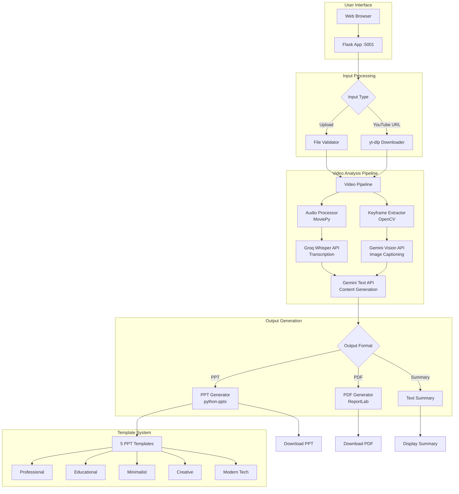
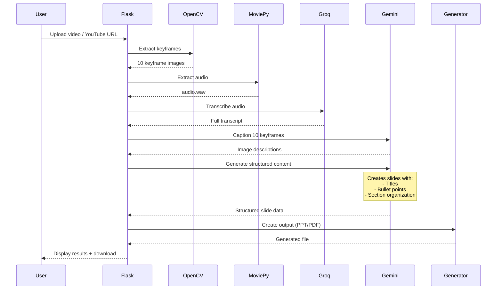

# VidScrib - AI-Powered Video Summarization Platform

Transform videos into professional PowerPoint presentations and PDFs using advanced AI technology.

## 🎯 Overview

VidScrib is an intelligent video processing system that automatically extracts key content from videos and generates professional presentations. It combines computer vision, speech-to-text, and AI-powered content generation to create comprehensive summaries in multiple formats.

### Key Features

- 🎥 **Multi-Source Support** - Upload videos or download from YouTube
- 🔍 **Smart Keyframe Extraction** - OpenCV-based motion and scene detection
- 🎤 **Fast Audio Transcription** - Groq Whisper API for lightning-fast speech-to-text
- 🤖 **AI-Powered Analysis** - Google Gemini 2.5 Flash for intelligent content generation
- 📊 **Multiple Output Formats** - PowerPoint (5 templates), PDF, or text summary
- 🎨 **Professional Templates** - Educational, Professional, Minimalist, Creative, Modern Tech
- ⚡ **Real-Time Progress** - Live updates during video processing
- 🔄 **Template Regeneration** - Change PPT templates without reprocessing video

---

## 🏗️ System Architecture



---

## 🔄 Processing Pipeline

### Step-by-Step Workflow



### Processing Stages

1. **Input Validation** (5s)
   - File format verification
   - Size limit check (2GB max)
   - Duration validation (45 min max)
   - YouTube URL download (if applicable)

2. **Keyframe Extraction** (10-15s)
   - Motion detection using optical flow
   - Histogram comparison for scene changes
   - Extracts 10 significant frames
   - Saves as JPG images

3. **Audio Processing** (20-30s)
   - Audio track extraction with MoviePy
   - Groq Whisper API transcription
   - Automatic language detection
   - Timestamp generation

4. **AI Analysis** (40-60s)
   - **Vision Pool**: Gemini captions 10 keyframes
   - **Text Pool**: Generates structured content
   - Creates title, sections, and bullet points
   - Validates slide count (5-20 slides)

5. **Output Generation** (5-10s)
   - PowerPoint with selected template
   - PDF with images and formatting
   - Text summary for web display

**Total Processing Time**: 80-120 seconds for 10-minute video

---

## 🛠️ Technology Stack

### Core Framework
- **Flask 3.0+** - Web application framework
- **Python 3.8+** - Programming language

### Video Processing
- **OpenCV 4.8+** - Keyframe extraction and computer vision
- **MoviePy 2.2+** - Audio/video manipulation
- **pytesseract 0.3+** - OCR for text extraction from frames

### AI/ML APIs & Models
- **Google Gemini 2.5 Flash** - Multimodal AI for vision and text
  - Vision tasks: Image captioning
  - Text tasks: Content generation, summarization
  - Dual-pool API key rotation system
- **Groq Whisper Large V3 Turbo** - Lightning-fast speech-to-text
  - Cloud-based transcription
  - 10-20x faster than local Whisper
  - Automatic audio chunking (19.5MB limit)

### Document Generation
- **python-pptx 0.6+** - PowerPoint presentation creation
- **ReportLab 4.4+** - PDF generation with images
- **Pillow 10.0+** - Image processing and manipulation

### Utilities
- **yt-dlp 2025.12+** - YouTube video downloading
- **pydub 0.25+** - Audio file manipulation
- **numpy 1.24+** - Numerical operations
- **python-dotenv 1.0+** - Environment variable management

### Frontend
- **HTML5/CSS3** - Modern responsive UI
- **Vanilla JavaScript** - Client-side interactions
- **Drag-and-drop** - File upload interface

---

## 📦 Installation

### Prerequisites
- Python 3.8 or higher
- pip package manager
- Tesseract OCR (for text extraction)

### Quick Setup

```bash
# 1. Clone or navigate to project directory
cd VidScrib

# 2. Install dependencies
pip install -r requirements.txt

# 3. Configure API keys
cp .env.example .env
# Edit .env and add your API keys:
# - GEMINI_API_KEY (required)
# - GEMINI_API_KEY_1 to GEMINI_API_KEY_5 (optional, for rotation)
# - GROQ_API_KEY (required)

# 4. Install Tesseract OCR
# macOS (Homebrew):
brew install tesseract

# Ubuntu/Debian:
sudo apt-get install tesseract-ocr

# Windows:
# Download from: https://github.com/UB-Mannheim/tesseract/wiki

# 5. Start the application
python app.py
# Or use the startup script:
./start.sh
```

### Environment Variables

Create a `.env` file in the project root:

```env
# Gemini API Keys (get from: https://aistudio.google.com/apikey)
GEMINI_API_KEY=your-primary-key-here
GEMINI_API_KEY_1=optional-key-2
GEMINI_API_KEY_2=optional-key-3
GEMINI_API_KEY_3=optional-key-4
GEMINI_API_KEY_4=optional-key-5
GEMINI_API_KEY_5=optional-key-6

# Groq API Key (get from: https://console.groq.com)
GROQ_API_KEY=your-groq-key-here

# Flask Configuration
FLASK_SECRET_KEY=your-secret-key-for-sessions
```

---

## 🚀 Usage

### Web Interface

1. Start the application:
   ```bash
   python app.py
   ```

2. Open browser to: **http://localhost:5001**

3. Upload video or paste YouTube URL

4. Select options:
   - **Output Format**: PowerPoint, PDF, or Summary
   - **PPT Template**: Professional, Educational, Minimalist, Creative, Modern Tech
   - **Slide Count**: Short (5-10), Medium (10-15), Detailed (15-20)

5. Wait for processing (progress bar shows real-time status)

6. Download your generated presentation!

### Command Line

Process a video directly via CLI:

```bash
# Basic usage
python -m pipeline.video_pipeline "path/to/video.mp4" ppt professional

# With slide count
python -m pipeline.video_pipeline "video.mp4" ppt educational --slides 15

# Generate PDF
python -m pipeline.video_pipeline "video.mov" pdf

# Text summary only
python -m pipeline.video_pipeline "video.mp4" summary
```

---

## ⚙️ Configuration

Edit `config.py` to customize behavior:

### Video Settings
```python
ALLOWED_EXTENSIONS = {'mp4', 'avi', 'mov', 'mkv', 'flv', 'wmv', 'webm', 'mpeg', 'mpg'}
MAX_FILE_SIZE = 2 * 1024 * 1024 * 1024  # 2GB
MAX_VIDEO_DURATION = 45 * 60  # 45 minutes
```

### Keyframe Extraction
```python
MOTION_THRESHOLD = 30          # Lower = more sensitive to motion
HISTOGRAM_THRESHOLD = 0.7      # Lower = more scene changes detected
MIN_FRAME_INTERVAL = 30        # Min frames between keyframes (1 sec @ 30fps)
MAX_KEYFRAMES = 10             # Maximum keyframes to extract
```

### Audio Transcription
```python
USE_GROQ_WHISPER = True        # True = Groq API, False = local Whisper
WHISPER_MODEL = "base"         # Local model: tiny/base/small/medium/large
WHISPER_LANGUAGE = "en"        # Language code or None for auto-detect
```

### AI Models
```python
GEMINI_MODEL = "gemini-2.5-flash"    # Gemini model name
GEMINI_TEMPERATURE = 0.7              # Creativity: 0.0-1.0
GEMINI_MAX_TOKENS = 2048              # Max response length
```

### Output Settings
```python
PPT_SLIDES_COUNT = 15           # Target number of content slides
PPT_INCLUDE_TIMESTAMPS = True   # Show timestamps on slides
PPT_INCLUDE_KEYFRAMES = True    # Include extracted images
DEFAULT_TEMPLATE = 'educational' # Default PPT template

PDF_INCLUDE_IMAGES = True       # Include keyframes in PDF
PDF_PAGE_SIZE = "A4"            # A4 or Letter
PDF_FONT_SIZE = 12              # Base font size
```

---

## 📁 Project Structure

```
VidScrib/
├── app.py                      # Flask web application (main entry point)
├── config.py                   # Configuration settings
├── requirements.txt            # Python dependencies
├── start.sh                    # Quick start script
├── .env                        # API keys (not in git)
├── .gitignore                  # Git ignore rules
│
├── core/                       # Core processing modules
│   ├── __init__.py
│   ├── audio_processor.py      # Audio extraction (MoviePy)
│   ├── groq_whisper.py         # Groq Whisper API integration
│   ├── keyframe_extractor.py   # OpenCV keyframe extraction
│   └── gemini_processor.py     # Gemini AI with dual-pool key rotation
│
├── pipeline/                   # Orchestration pipeline
│   ├── __init__.py
│   └── video_pipeline.py       # Main video processing pipeline
│
├── generators/                 # Output format generators
│   ├── __init__.py
│   ├── ppt_generator.py        # PowerPoint generation (python-pptx)
│   ├── pdf_generator.py        # PDF generation (ReportLab)
│   └── templates/              # PPT template files (.pptx)
│       ├── professional.pptx
│       ├── educational.pptx
│       ├── minimalist.pptx
│       ├── creative.pptx
│       └── modern_tech.pptx
│
├── utils/                      # Helper utilities
│   ├── __init__.py
│   ├── validators.py           # Input validation
│   ├── file_handler.py         # File operations
│   ├── helpers.py              # General helpers
│   ├── logger.py               # Logging configuration
│   └── youtube_downloader.py   # YouTube download (yt-dlp)
│
├── templates/                  # Flask HTML templates
│   └── index.html              # Main web UI
│
├── static/                     # Static web assets
│   ├── css/
│   │   └── style.css           # UI styling
│   ├── js/
│   │   └── script.js           # Frontend JavaScript
│   └── images/
│       ├── logo.png
│       └── templates/          # Template preview images
│           ├── professional.png
│           ├── educational.png
│           ├── minimalist.png
│           ├── creative.png
│           └── modern_tech.png
│
├── docs/                       # Documentation
│   ├── WORKFLOW.md             # Detailed workflow documentation
│   ├── QUICKSTART.md           # Quick start guide
│   ├── API_REFERENCE.md        # API documentation
│   ├── GEMINI_SETUP.md         # Gemini API setup guide
│   └── LOGGING_INFO.md         # Logging information
│
├── outputs/                    # Generated presentations (gitignored)
├── temp/                       # Temporary processing files (gitignored)
├── logs/                       # Application logs (gitignored)
├── saved_results/              # Cached processing results
└── venv/                       # Python virtual environment (gitignored)
```

---

## 🎨 PowerPoint Templates

VidScrib includes 5 professionally designed templates:

### 1. **Professional** 
- Clean corporate style
- Navy blue and white theme
- Best for: Business presentations, reports

### 2. **Educational**
- Friendly learning atmosphere
- Warm colors with visual aids
- Best for: Tutorials, lectures, training

### 3. **Minimalist**
- Simple black and white
- Lots of whitespace
- Best for: Technical content, data

### 4. **Creative**
- Vibrant gradients
- Bold typography
- Best for: Marketing, creative projects

### 5. **Modern Tech**
- Dark mode with neon accents
- Futuristic design
- Best for: Tech demos, startups

All templates feature:
- ✅ **7 Layout Types**: Title, Content, Two-Column, Image, TOC, Thank You
- ✅ **Consistent Styling**: Fonts, colors, spacing
- ✅ **Background Graphics**: Preserved during generation
- ✅ **Smart Layout Mapping**: Auto-selects best layout per slide

---

## 🔑 API Documentation

### Gemini Processor (Dual-Pool Architecture)

VidScrib uses a sophisticated dual-pool API key rotation system:

- **Vision Pool**: Dedicated keys for image captioning (slower, higher cost)
- **Text Pool**: Dedicated keys for text generation (faster, lower cost)
- **Auto-Rotation**: Switches keys on rate limits
- **Retry Logic**: Exponential backoff with intelligent wait times

**Key Methods**:
```python
# Image captioning (Vision Pool)
gemini.generate_image_caption(image_path, custom_prompt)
gemini.generate_captions_batch(image_paths, delay=6.5)

# Content generation (Text Pool)
gemini.create_video_summary(transcript, captions)
gemini.create_content_sections(transcript, num_sections)

# Visual selection
gemini.select_key_visuals(captions, transcript, num_visuals)
```

### Groq Whisper Integration

Fast, cloud-based speech-to-text:

```python
groq = GroqWhisperProcessor(api_key)

# Transcribe audio
result = groq.transcribe_audio("audio.wav", language="en")

# Automatic chunking for large files
result = groq.transcribe_large_audio("long_audio.wav")

# Result structure
{
    'text': 'Full transcript...',
    'language': 'en',
    'segments': [
        {'start': 0.0, 'end': 5.2, 'text': '...'},
        ...
    ],
    'duration': 120.5
}
```

### Flask Routes

**Main Endpoints**:
- `GET /` - Main web interface
- `POST /upload` - Video upload/YouTube URL processing
- `GET /status/<output_name>` - Processing status (JSON)
- `GET /download/<output_name>` - Download generated file
- `POST /regenerate/<output_name>` - Regenerate PPT with new template
- `GET /results/<output_name>` - View results page
- `GET /temp/<filename>` - Serve temporary files (keyframes)

**Example API Usage**:
```javascript
// Start processing
const formData = new FormData();
formData.append('video', videoFile);
formData.append('outputFormat', 'ppt');
formData.append('template', 'professional');
formData.append('slideCount', '10');

fetch('/upload', {
    method: 'POST',
    body: formData
}).then(res => res.json());

// Check status
fetch('/status/' + outputName)
    .then(res => res.json())
    .then(data => {
        console.log(data.progress, data.message);
    });

// Regenerate with different template
fetch('/regenerate/' + outputName, {
    method: 'POST',
    headers: { 'Content-Type': 'application/json' },
    body: JSON.stringify({ template: 'educational' })
});
```

---

## 🔍 Features in Detail

### 1. Keyframe Extraction
- **Motion Detection**: Optical flow analysis
- **Scene Change Detection**: Histogram comparison
- **Intelligent Sampling**: Avoids redundant frames
- **Configurable Sensitivity**: Adjust thresholds
- **OCR Integration**: Extract text from frames using Tesseract

### 2. Audio Transcription
- **Groq Whisper API**: 10-20x faster than local models
- **Auto Language Detection**: Supports 50+ languages
- **Large File Handling**: Automatic chunking for files >19.5MB
- **Timestamp Precision**: Segment-level timing
- **Fallback Option**: Local Whisper model support

### 3. AI Content Generation
- **Structured Output**: Title, sections, bullet points
- **Smart Slide Count**: Honors user preference (5-20 slides)
- **Layout Detection**: Auto-assigns comparison/feature slides
- **Image-Text Alignment**: Matches keyframes to relevant content
- **Fallback Content**: Generates basic slides if AI fails

### 4. Template Regeneration
- **Zero API Calls**: Reuses cached AI output
- **Instant Switching**: Try all 5 templates
- **Preserved Content**: Same slides, new design
- **Saved Results**: Load previous processing sessions

### 5. YouTube Support
- **Direct Download**: yt-dlp integration
- **Format Selection**: Best quality up to 2GB
- **Metadata Extraction**: Title, duration, description
- **Error Handling**: Invalid URLs, geo-restrictions

---

## 📊 Performance Metrics

### Processing Times (10-minute video)

| Stage | Duration | Notes |
|-------|----------|-------|
| **Upload/Validation** | 5-10s | Depends on file size |
| **Keyframe Extraction** | 10-15s | 10 frames @ 1080p |
| **Audio Extraction** | 5-10s | MoviePy processing |
| **Transcription (Groq)** | 20-30s | Cloud API |
| **Image Captioning** | 30-50s | 10 images × 3-5s each |
| **Content Generation** | 10-15s | Structured slides |
| **PPT Generation** | 5-10s | Template application |
| **Total** | **85-140s** | ~1.5-2.5 minutes |

### API Usage (per video)

| Service | Calls | Tokens | Cost (est.) |
|---------|-------|--------|-------------|
| **Groq Whisper** | 1-3 | N/A | Free tier |
| **Gemini Vision** | 10 | ~5K | $0.05 |
| **Gemini Text** | 1 | ~10K | $0.01 |
| **Total** | 12-14 | ~15K | **$0.06** |

*Costs are estimates based on Gemini free tier limits*

### Rate Limits

**Gemini Free Tier**:
- 15 requests/minute
- 1,000,000 tokens/day
- ~6 videos/day with dual-pool rotation

**Groq Free Tier**:
- 30 requests/minute
- 14,400 requests/day
- ~500 videos/day

---

## 🐛 Troubleshooting

### Common Issues

#### 1. **ModuleNotFoundError: No module named 'google'**
**Solution**: Install google-generativeai
```bash
pip install google-generativeai
```

#### 2. **Port 5001 already in use**
**Solution**: Change port in `config.py`
```python
FLASK_PORT = 5002  # Or any available port
```

#### 3. **Groq API authentication error**
**Solution**: Check API key in `.env`
```bash
echo $GROQ_API_KEY  # Should show your key
# or
cat .env | grep GROQ
```

#### 4. **Tesseract not found**
**Solution**: Install Tesseract and update path in `config.py`
```python
# macOS (Homebrew - Apple Silicon)
TESSERACT_CMD = "/opt/homebrew/bin/tesseract"

# macOS (Homebrew - Intel)
TESSERACT_CMD = "/usr/local/bin/tesseract"

# Windows
TESSERACT_CMD = "C:\\Program Files\\Tesseract-OCR\\tesseract.exe"

# Linux
TESSERACT_CMD = "/usr/bin/tesseract"
```

#### 5. **Video processing fails silently**
**Solution**: Check logs
```bash
tail -f logs/app.log
```

#### 6. **Rate limit errors**
**Solution**: Add more API keys to `.env` for rotation
```env
GEMINI_API_KEY_1=key-2
GEMINI_API_KEY_2=key-3
# etc.
```

#### 7. **YouTube download fails**
**Solution**: Update yt-dlp
```bash
pip install --upgrade yt-dlp
```

---

## 🔒 Security & Privacy

### Data Handling
- ✅ Uploaded videos are auto-deleted after processing
- ✅ Temporary files cleaned up automatically
- ✅ Generated outputs kept for 24 hours
- ✅ No data sent to third parties (except AI APIs)
- ✅ API keys stored in `.env` (not committed to git)

### API Security
- Gemini API: Google's privacy policy applies
- Groq API: Groq's privacy policy applies
- No video content stored by VidScrib servers

---

## 🚀 Deployment

### Production Checklist

1. **Update configuration**:
   ```python
   FLASK_DEBUG = False
   AUTO_DELETE_UPLOADS = True
   AUTO_DELETE_TEMP = True
   ```

2. **Use production server**:
   ```bash
   pip install gunicorn
   gunicorn -w 4 -b 0.0.0.0:5001 app:app
   ```

3. **Enable async processing** (optional):
   ```bash
   pip install celery redis
   # Update config.py:
   ENABLE_ASYNC_PROCESSING = True
   ```

4. **Set up reverse proxy** (nginx):
   ```nginx
   server {
       listen 80;
       server_name yourdomain.com;
       
       location / {
           proxy_pass http://localhost:5001;
           proxy_set_header Host $host;
           proxy_set_header X-Real-IP $remote_addr;
       }
   }
   ```

5. **Configure SSL** (Let's Encrypt):
   ```bash
   sudo certbot --nginx -d yourdomain.com
   ```

---

## 📚 Documentation

Additional documentation available in `/docs`:

- [**WORKFLOW.md**](docs/WORKFLOW.md) - Detailed system workflow and architecture
- [**QUICKSTART.md**](docs/QUICKSTART.md) - Quick start guide
- [**API_REFERENCE.md**](docs/API_REFERENCE.md) - Complete API documentation
- [**GEMINI_SETUP.md**](docs/GEMINI_SETUP.md) - Gemini API setup instructions
- [**LOGGING_INFO.md**](docs/LOGGING_INFO.md) - Logging configuration

---

## 🎯 Use Cases

1. **Education**
   - Convert lecture recordings to study guides
   - Create presentation summaries from tutorials
   - Generate course material from video lessons

2. **Business**
   - Summarize meeting recordings
   - Create client presentation decks
   - Document product demos

3. **Content Creation**
   - Repurpose YouTube videos into slide decks
   - Create webinar summaries
   - Generate conference talk summaries

4. **Research**
   - Extract key points from research talks
   - Summarize documentary footage
   - Document experimental procedures

---

## 🛣️ Roadmap

- [ ] Multi-language support for generated content
- [ ] Custom template upload
- [ ] Video trimming/segment selection
- [ ] Speaker detection and attribution
- [ ] Animated transitions in PPT
- [ ] Collaborative editing
- [ ] API-only mode for integration

---

## 🤝 Contributing

Contributions are welcome! Please:

1. Fork the repository
2. Create a feature branch
3. Make your changes
4. Submit a pull request

---

## 📄 License

MIT License - see LICENSE file for details

---

## 🙏 Acknowledgments

- **Google Gemini** - Multimodal AI capabilities
- **Groq** - Ultra-fast Whisper API
- **OpenCV** - Computer vision tools
- **python-pptx** - PowerPoint generation
- **yt-dlp** - YouTube download functionality

---

## 📞 Support

For issues, questions, or feedback:
- Create an issue on GitHub
- Check documentation in `/docs`
- Review logs in `/logs/app.log`

---

**Built with ❤️ by VidScrib Team**  
**Version**: 2.0  
**Last Updated**: January 2026