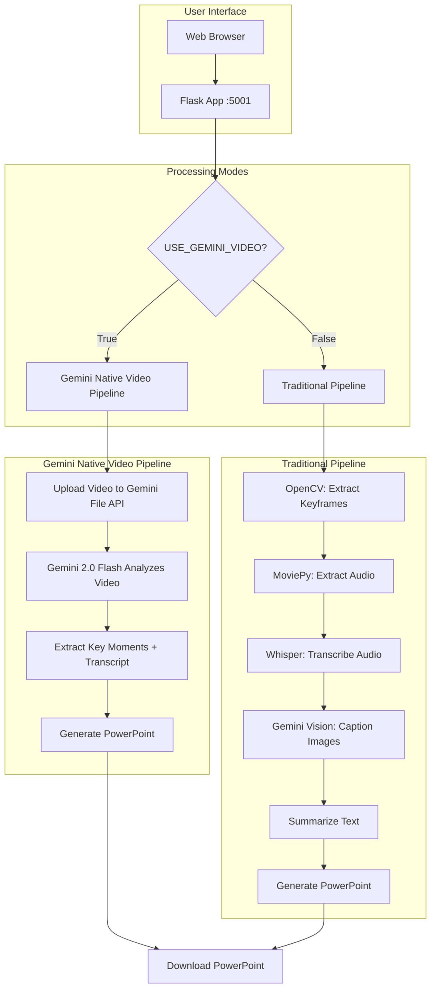
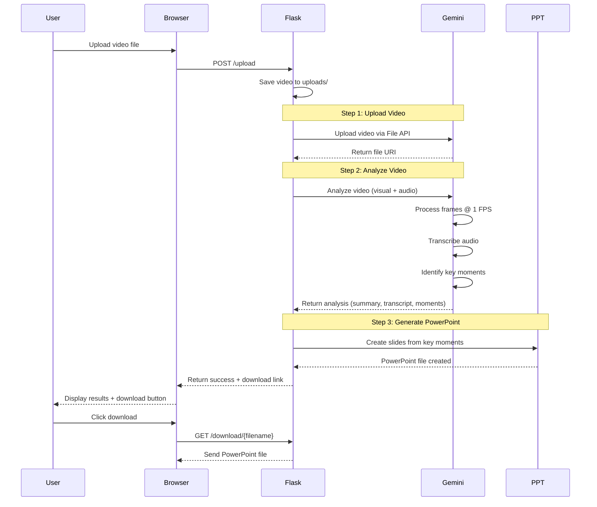
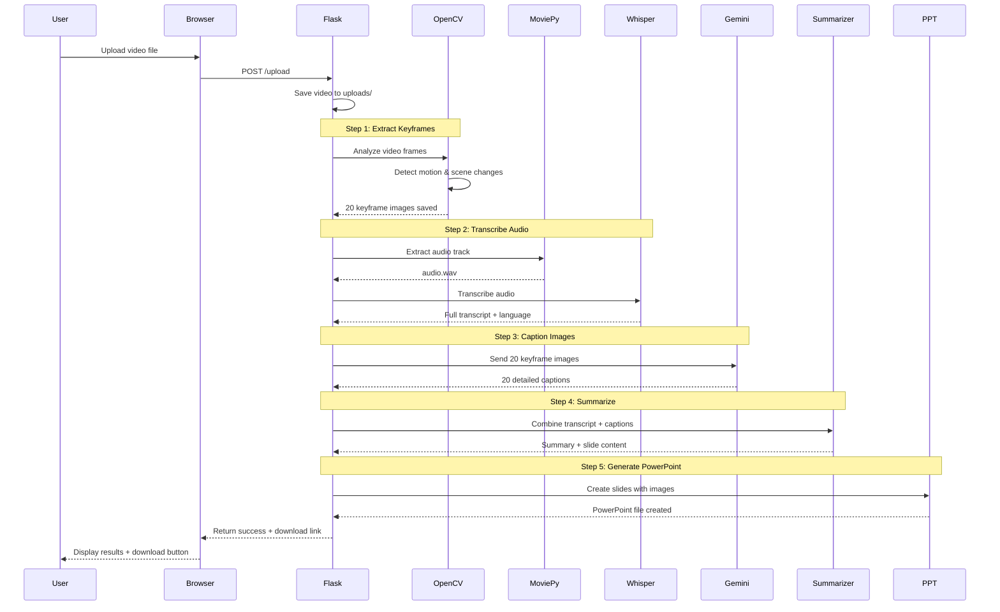

# Video Summarizer - Complete System Workflow

## 🎯 System Overview

The Video Summarizer transforms videos into PowerPoint presentations using AI. It supports **two processing modes**:

1. **🎬 Gemini Native Video Mode** - Single AI call processes entire video
2. **🔧 Traditional Multi-Step Mode** - Separate steps for keyframes, audio, and captions

---

## 🏗️ System Architecture



---

## 📊 Processing Mode Comparison

| Feature | Gemini Native Video | Traditional Pipeline |
|---------|-------------------|---------------------|
| **Speed** | ⚡ Faster (1 API call) | 🐢 Slower (5+ steps) |
| **Accuracy** | 🎯 Better context understanding | ✅ Good but separate analysis |
| **API Calls** | 1 (Gemini File API) | Multiple (Whisper + Gemini Vision) |
| **Keyframes** | Virtual (timestamps only) | 📸 Actual image files extracted |
| **Cost** | 💰 Lower (single call) | 💰💰 Higher (multiple calls) |
| **Dependencies** | Gemini API only | OpenCV + Whisper + Gemini |

---

## 🎬 Workflow 1: Gemini Native Video Mode

### Prerequisites
- ✅ `USE_GEMINI_VIDEO = True` in `config.py`
- ✅ `GEMINI_API_KEY` set in environment or `.env`

### Step-by-Step Flow



### Detailed Steps

#### **Step 1: Upload Video to Gemini** 📤
```
Input:  Video file (MP4, AVI, MOV, etc.)
Action: Upload to Gemini File API
Output: File URI (e.g., "files/abc123xyz")
Logs:   "📤 Step 1/3: Uploading video to Gemini File API..."
```

#### **Step 2: Analyze with Gemini** 🔍
```
Input:  File URI + Analysis prompt
Action: Gemini processes:
        - Visual content (1 frame/second)
        - Audio transcription
        - Key moment identification
        - Comprehensive summary
Output: {
          summary: "Video overview...",
          transcript: "Full spoken content...",
          key_moments: [
            {timestamp: 15, description: "..."},
            {timestamp: 45, description: "..."}
          ]
        }
Logs:   "🔍 Step 2/3: Analyzing video with gemini-2.0-flash-exp..."
        "   ├─ Processing visual content (sampled frames)"
        "   ├─ Processing audio/speech"
        "   ├─ Identifying key moments with timestamps"
        "   └─ Generating comprehensive analysis"
```

#### **Step 3: Generate PowerPoint** 📊
```
Input:  Key moments + summary
Action: Create slides:
        - Title slide with summary
        - One slide per key moment
        - Timestamp + description on each
Output: PowerPoint file (.pptx)
Logs:   "📊 Step 3/3: Generating PowerPoint..."
        "   ├─ Creating 20 slides"
        "   └─ Format: Text-based with timestamps"
```

---

## 🔧 Workflow 2: Traditional Multi-Step Mode

### Prerequisites
- ✅ `USE_GEMINI_VIDEO = False` in `config.py`
- ✅ OpenCV, Whisper, Gemini API installed

### Step-by-Step Flow



### Detailed Steps

#### **Step 1: Extract Keyframes** 🎞️
```
Tool:   OpenCV (cv2)
Input:  Video file
Action: - Analyze each frame
        - Detect motion (optical flow)
        - Compare histograms
        - Select significant frames
Config: - Motion threshold: 30
        - Histogram threshold: 0.7
        - Min interval: 30 frames
        - Max keyframes: 20
Output: 20 JPG images saved to temp/keyframes/
Logs:   "🔧 Step 1/5: Extracting keyframes..."
        "Extracted keyframe 1 at frame 0 (0.00s)"
        "Extracted keyframe 2 at frame 294 (9.81s)"
```

#### **Step 2: Transcribe Audio** 🎤
```
Tool:   MoviePy + Whisper
Input:  Video file
Action: - Extract audio track → audio.wav
        - Load Whisper model (base)
        - Transcribe speech to text
Config: - Model: base
        - Language: Auto-detect
Output: {
          text: "Full transcript...",
          language: "en",
          segments: [...]
        }
Logs:   "============================================================"
        "🎤 WHISPER MODEL LOADING"
        "   Model Size: base"
        "   Language: Auto-detect"
        "   Purpose: Audio transcription"
        "============================================================"
```

#### **Step 3: Generate Captions** 🖼️
```
Tool:   Gemini Vision API
Input:  20 keyframe images
Action: For each image:
        - Send to Gemini
        - Get detailed description
Config: - Model: gemini-2.0-flash-exp
        - Prompt: "Describe this video frame..."
Output: 20 captions like:
        "Screenshot showing n8n workflow interface..."
Logs:   "============================================================"
        "✅ GEMINI VISION INITIALIZED"
        "   Model: gemini-2.0-flash-exp"
        "   Purpose: Image caption generation"
        "============================================================"
        "Processing image 1/20"
        "Generated Gemini caption: Screenshot showing..."
```

#### **Step 4: Summarize Content** 📝
```
Tool:   Text Summarizer
Input:  - Full transcript
        - 20 image captions
        - Keyframe timestamps
Action: - Extract key sentences
        - Combine visual + audio info
        - Create slide content
Output: {
          overall_summary: "Video overview...",
          slides: [
            {title: "...", content: "...", image_caption: "..."},
            ...
          ]
        }
Logs:   "Step 4/5: Creating summary..."
        "Created summary: 179 characters"
        "Created 20 slides"
```

#### **Step 5: Generate PowerPoint** 📊
```
Tool:   python-pptx
Input:  - Slide content
        - Keyframe images
        - Overall summary
Action: - Create title slide
        - Add content slides
        - Insert images
        - Format text
Output: PowerPoint file (.pptx)
Logs:   "Step 5/5: Generating PowerPoint..."
        "Presentation saved to output/video_summary.pptx"
```

---

## 🌐 Web Interface Flow

### 1. **Upload Screen**
```
┌─────────────────────────────────────┐
│   Video Summarizer                  │
│   Transform videos into             │
│   presentations with AI             │
│                                     │
│   ┌───────────────────────────┐   │
│   │                           │   │
│   │   Drop your video here    │   │
│   │   or click to browse      │   │
│   │                           │   │
│   └───────────────────────────┘   │
│                                     │
│   Supported: MP4, AVI, MOV, MKV    │
│   Max size: 500MB                  │
└─────────────────────────────────────┘
```

### 2. **Processing Screen**
```
┌─────────────────────────────────────┐
│   Processing Your Video...          │
│                                     │
│   ████████████░░░░░░░░  60%        │
│                                     │
│   Current Step:                     │
│   🔍 Analyzing video with Gemini    │
│                                     │
│   Please wait...                    │
└─────────────────────────────────────┘
```

### 3. **Results Screen**
```
┌─────────────────────────────────────┐
│   ✅ Processing Complete!           │
│                                     │
│   📊 Statistics:                    │
│   • Keyframes: 20                   │
│   • Slides: 20                      │
│   • Language: English               │
│                                     │
│   📝 Summary:                       │
│   This video demonstrates...        │
│                                     │
│   [Download PowerPoint] [New Video] │
└─────────────────────────────────────┘
```

---

## 🔑 Configuration Options

### In `config.py`:

```python
# Choose Processing Mode
USE_GEMINI_VIDEO = True   # Gemini Native (recommended)
USE_GEMINI_VIDEO = False  # Traditional Pipeline

# Gemini Settings
GEMINI_API_KEY = "..."           # Your API key
GEMINI_MODEL = "gemini-2.0-flash-exp"

# Keyframe Settings (Traditional mode)
MAX_KEYFRAMES = 20               # Number of keyframes
MOTION_THRESHOLD = 30            # Motion sensitivity
HISTOGRAM_THRESHOLD = 0.7        # Scene change sensitivity

# Whisper Settings (Traditional mode)
WHISPER_MODEL = "base"           # tiny/base/small/medium/large

# PowerPoint Settings
PPT_TITLE = "Video Summary"
SUMMARY_MAX_LENGTH = 500         # Max words in summary
```

---

## 📁 File Structure

```
video_summarizer/
├── app.py                      # Flask web server
├── config.py                   # Configuration settings
├── pipeline_gemini.py          # Enhanced pipeline (both modes)
├── gemini_video_analyzer.py    # Gemini video processing
├── keyframe_extractor.py       # OpenCV keyframe extraction
├── audio_processor.py          # Whisper transcription
├── caption_generator.py        # Gemini vision captions
├── text_summarizer.py          # Text summarization
├── ppt_generator.py            # PowerPoint creation
├── templates/
│   └── index.html              # Web UI
├── static/
│   ├── style.css               # Styling
│   └── script.js               # Frontend logic
├── uploads/                    # Uploaded videos
├── output/                     # Generated PowerPoints
└── temp/                       # Temporary files
```

---

## 🚀 Quick Start Commands

```bash
# 1. Activate virtual environment
source "/Users/falahi/abdu project video summary/.venv/bin/activate"

# 2. Set Gemini API key
export GEMINI_API_KEY="your-key-here"

# 3. Start the application
python3 app.py

# 4. Open browser
open http://localhost:5001
```

---

## 📊 Performance Metrics

### Gemini Native Video Mode
- **Upload**: ~5-10 seconds (depends on file size)
- **Analysis**: ~30-60 seconds (for 5-10 min video)
- **PPT Generation**: ~2-5 seconds
- **Total**: ~40-75 seconds

### Traditional Mode
- **Keyframe Extraction**: ~5-10 seconds
- **Audio Transcription**: ~20-40 seconds (Whisper base)
- **Image Captioning**: ~40-80 seconds (20 images × 2-4s each)
- **Summarization**: ~1-2 seconds
- **PPT Generation**: ~2-5 seconds
- **Total**: ~70-140 seconds

---

## 🎯 Use Cases

1. **Meeting Recordings** → Key discussion points presentation
2. **Tutorial Videos** → Step-by-step guide slides
3. **Lectures** → Study notes with timestamps
4. **Product Demos** → Feature highlight presentation
5. **Webinars** → Summary deck for attendees

---

## 🔍 Troubleshooting

### Issue: "No module named 'google'"
**Solution**: Install in venv
```bash
source .venv/bin/activate
pip install google-generativeai
```

### Issue: Port 5001 already in use
**Solution**: Change port in `app.py`
```python
app.run(port=5002)
```

### Issue: Video processing fails
**Solution**: Check logs for specific error
- Gemini API key valid?
- Video format supported?
- File size under 500MB?

---

## 📚 API Documentation

### Gemini File API
- **Upload**: `genai.upload_file(path)`
- **Status**: `genai.get_file(name)`
- **Delete**: `genai.delete_file(name)`

### Gemini Generate Content
```python
response = model.generate_content([
    video_file,
    "Analyze this video..."
])
```

---

**Created by**: Video Summarizer System  
**Version**: 2.0 (Gemini Native + Traditional)  
**Last Updated**: 2025-12-06
